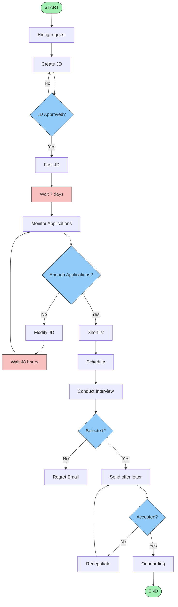

```mermaid
graph TD
    Start([START]) --> HR[Hiring request]
    HR --> CJD[Create JD]
    CJD --> JDA{JD Approved?}
    
    JDA -- No --> CJD
    JDA -- Yes --> PJD[Post JD]
    
    PJD --> W7[Wait 7 days]
    W7 --> MA[Monitor Applications]
    MA --> EA{Enough Applications?}
    
    EA -- No --> MJD[Modify JD]
    MJD --> W48[Wait 48 hours]
    W48 --> MA
    
    EA -- Yes --> SL[Shortlist]
    SL --> Sched[Schedule]
    Sched --> CI[Conduct Interview]
    CI --> Sel{Selected?}
    
    Sel -- No --> RE[Regret Email]
    Sel -- Yes --> SOL[Send offer letter]
    
    SOL --> Acc{Accepted?}
    
    Acc -- No --> RN[Renegotiate]
    RN --> SOL
    
    Acc -- Yes --> OB[Onboarding]
    OB --> End([END])
    
    style Start fill:#a2eeb3,stroke:#333,stroke-width:1px
    style End fill:#a2eeb3,stroke:#333,stroke-width:1px
    style JDA fill:#90cbf9,stroke:#333,stroke-width:1px
    style EA fill:#90cbf9,stroke:#333,stroke-width:1px
    style Sel fill:#90cbf9,stroke:#333,stroke-width:1px
    style Acc fill:#90cbf9,stroke:#333,stroke-width:1px
    style W7 fill:#f9c0c0,stroke:#333,stroke-width:1px
    style W48 fill:#f9c0c0,stroke:#333,stroke-width:1px
```
